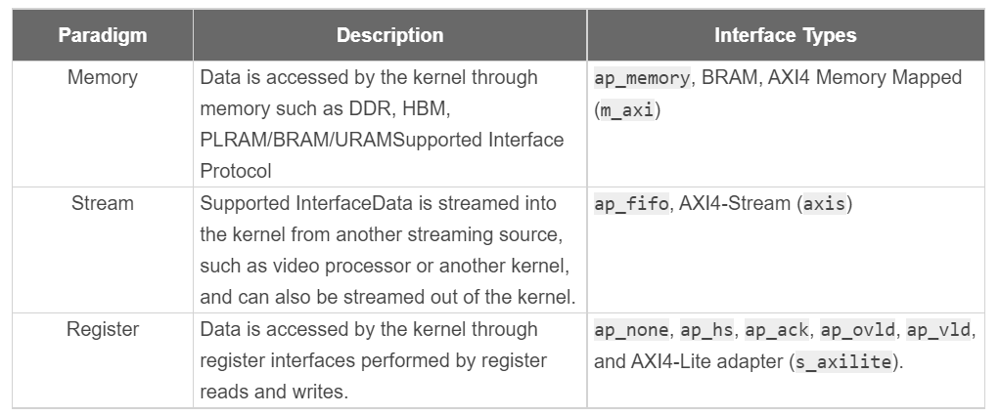

# Defining Interface

Vitis™ HLS 设计的顶层函数的实参均综合到接口和端口内，这些接口和端口通过将多个信号加以组合来定义 HLS 设计与设计外部的组件之间的通信协议。Vitis HLS 会自动定义接口，并使用业界标准来指定要使用的协议。Vitis HLS 创建的接口类型取决于顶层函数的参数的数据类型和方向、处于活动状态的解决方案的目标流程、 [config_interface](https://docs.xilinx.com/r/en-US/ug1399-vitis-hls/config_interface) 指定的默认接口配置设置以及任何指定的 [INTERFACE](https://docs.xilinx.com/r/en-US/ug1399-vitis-hls/config_interface) 编译指示或指令。

**TIP**: 我们可使用 INTERFACE 编译指示或指令手动分配接口。如需了解更多信息，请参阅[添加编译指示和指令](https://docs.xilinx.com/r/en-US/ug1399-vitis-hls/Adding-Pragmas-and-Directives)。
如 [Vitis HLS 进程概述](https://docs.xilinx.com/r/en-US/ug1399-vitis-hls/Vitis-HLS-Process-Overview) 中所述，Vitis HLS 支持的目标流程包括：

- 作为工具的默认流程的 Vivado® IP 流程
- Vitis kernel流程，它是自下而上的设计流程，适用于 Vitis 应用加速开发流程
我们可在创建工程解决方案时按 [创建新的 Vitis HLS 工程 中所述](https://docs.xilinx.com/r/en-US/ug1399-vitis-hls/Creating-a-New-Vitis-HLS-Project)或者使用以下命令指定目标流程：
```
open_solution -flow_target [vitis | vivado]
```
此接口可定义Kernel的 3 个元素：
1. 此接口可为流入或流出 HLS 设计的数据定义通道。数据可从多种外部来源流入Kernel或 IP，外部来源包括：主机应用、外部相机或传感器或者赛灵思器件上实现的其它Kernel或 IP 等。Vitis Kernel的默认通道是 AXI 适配器，如 [适用于 Vitis Kernel流程的接口](https://docs.xilinx.com/r/en-US/ug1399-vitis-hls/Interfaces-for-Vitis-Kernel-Flow) 中所述。
2. 此接口负责定义端口协议，此协议用于控制流经数据通道的数据流，定义何时数据有效并且可供读取或可供写入，如 [端口级 I/O 协议](https://docs.xilinx.com/r/en-US/ug1399-vitis-hls/Port-Level-I/O-Protocols) 中所述。

    **TIP:** 这些端口协议可在 Vivado IP 流程中自定义，但在 Vitis Kernel流程中设置且在大多数情况下不可更改。
3. 此接口还负责定义 HLS 设计的执行控制方案，指定Kernel或 IP 操作方式为流水打拍还是顺序，如 [块级控制协议](https://docs.xilinx.com/r/en-US/ug1399-vitis-hls/Block-Level-Control-Protocols) 中所述。

如 [设计高效Kernel](./Design_Mathodology.md) 中所述，接口的选择与配置是设计成功与否的关键。但是，Vitis HLS 会尝试通过为目标流程选择默认接口来简化进程。如需了解有关所使用的默认接口的更多信息，请根据我们的设计参阅相应的 [Vivado IP 流程接口](https://docs.xilinx.com/r/en-US/ug1399-vitis-hls/Interfaces-for-Vivado-IP-Flow) 或 适用于 [Vitis Kernel流程的接口](https://docs.xilinx.com/r/en-US/ug1399-vitis-hls/Interfaces-for-Vitis-Kernel-Flow)。

完成综合后，我们可在 [综合汇总](https://docs.xilinx.com/r/en-US/ug1399-vitis-hls/Synthesis-Summary) 报告的“软件 I/O 信息”部分中复查将 C/C++ 代码的软件实参映射到硬件端口或接口的方式是否正确。

### Part1: 适用于 Vitis Kernel流程的接口

Vitis Kernel流程为已编译的Kernel对象 (.xo) 提供支持，以便从主机应用和赛灵思的 Xilinx Run Time (XRT) 来执行软件控制。如 Vitis 统一软件平台文档中的Kernel属性 中所述，此流程具有非常具体的接口要求，Vitis HLS 必须满足这些要求。

Vitis HLS 支持多种存储器、串流和寄存器接口范例，其中每个范例都遵循某个接口协议并使用适配器来与外部世界进行通信。

- 存储器范例 (m_axi)：Kernel通过存储器（如 DDR、HBM、PLRAM/BRAM/URAM）来访问数据

- 数据流范例 (axis)：数据从其它串流源（例如，视频处理器或其它Kernel）串流至Kernel中，也可从该Kernel流出。

- 寄存器范例 (s_axilite)：Kernel通过寄存器接口来访问数据，软件则通过寄存器读/写来访问数据。

Vitis Kernel流程默认会实现下列接口：


如上表所示，指向阵列的指针是作为 m_axi 接口（用于数据传输）来实现的，指向标量的指针则是使用 s_axilite 接口来实现的。作为常量来传递的标量值不需要读取权限，而指向标量值的指针则需要读取和写入权限。s_axilite 接口会根据 C 语言实参类型来实现一项额外的内部协议。此内部实现可使用 端口级 I/O 协议 来控制。但如非必要，不应在 Vitis Kernel流程中修改默认端口协议。

注释： 当元素需要不同接口类型时，Vitis HLS 将不会自动推断结构体/类的成员元素的默认接口。例如，当某个结构体的某个元素需要串流接口，而另一个成员元素需要 s_axilite 接口时，就是如此。我们不能依靠默认接口分配，而必须为结构体的每个元素显式定义 INTERFACE 编译指示。如未定义任何 INTERFACE 编译指示或指令，则 Vitis HLS 将发出以下错误消息：
```
ERROR: [HLS 214-312] Vitis mode requires explicit INTERFACE pragmas for structs in the interface. Please add one INTERFACE pragma for each struct member field for argument 'd' of function 'dut(A&)' (example.cpp:19:0)
```
Vitis Kernel流程的默认执行模式为流水打拍执行，即启用Kernel的重叠执行以改善吞吐量。这是通过 s_axilite 接口上的 ap_ctrl_chain 块控制协议来指定的。

 Vitis 环境支持含所有受支持的块控制协议的Kernel，如 [块级控制协议](https://docs.xilinx.com/r/en-US/ug1399-vitis-hls/Block-Level-Control-Protocols) 中所述。

### Part2: 适用于 Vivado IP流程的接口

 Vivado IP流程支持多种I/O协议和握手，这是由于支持FPGA设计的各种应用的需求。该流程支持将多个IP集成到一个系统中的传统系统设计流程。可以通过Vitis HLS生成IP。在Vivado IP流程中，系统的执行有两种控制模式:

- 软件控制(Software Control): 通过运行在嵌入式Arm处理器或外接x86处理器上的软件应用程序对系统进行控制，通过驱动程序访问硬件设计的元素，通过读写硬件中的寄存器来控制IP在系统中的执行。

- 自同步(Self Synchronous): 在这种模式下，IP本身有用于启动和停止内核的信号。这些信号由其他IP或处理IP执行的系统设计的其他元素驱动。

Vivado IP 流程支持内存、数据流和寄存器接口范式，其中每种范式支持不同的接口协议与外部世界通信，如下表所示。注意，虽然Vitis内核流只支持AXI4接口适配器，但Vivado IP 流程支持许多不同的接口类型。



Vivado IP 流程默认接口由顶层函数中的 C 参数类型和默认范式定义，如下表所示。


Vivado IP流程的默认执行模式是顺序执行，这要求HLS IP在开始下一个迭代之前完成一个迭代。这是由ap_ctrl_hs块控制协议指定的。控制协议可以根据 [块级控制协议](https://docs.xilinx.com/r/en-US/ug1399-vitis-hls/Block-Level-Control-Protocols) 中的指定进行更改。