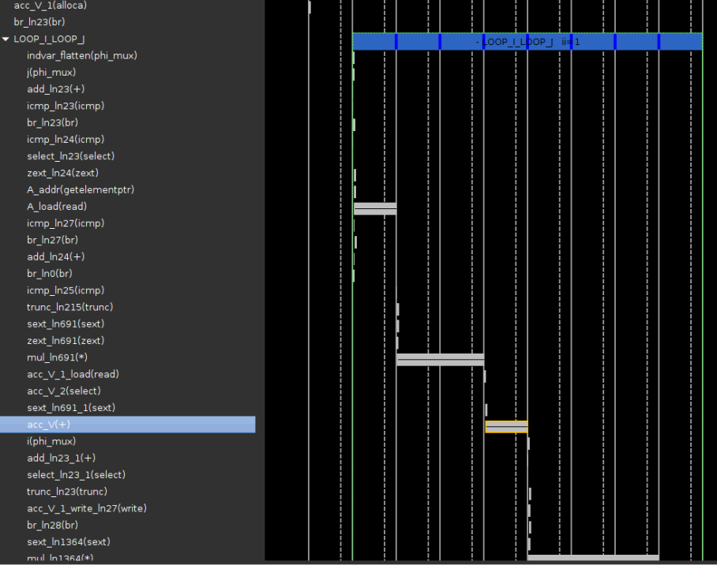
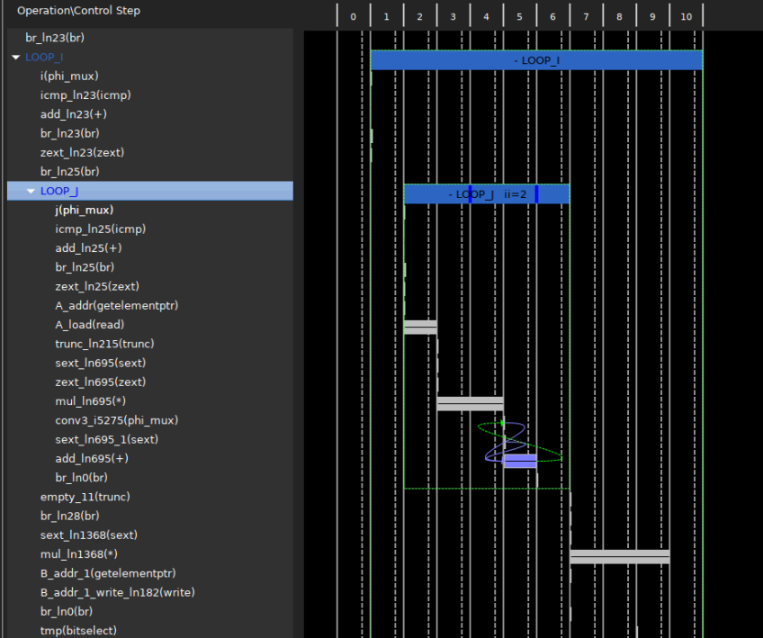
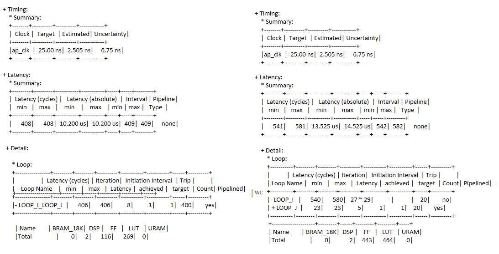

# Fine-grained Function and Loop Level Parallel Optimization | Unroll & Pipeline

HLS 优化设计的最关键指令有两个：一个是流水线（pipeline）指令，一个是数据流(dataflow)指令。
正确地使用好这两个指令能够增强算法地并行性，提升吞吐量，降低延迟但是需要遵循一定的代码风格。展开(unroll)指令是只针对for循环的展开指令，和流水线指令关系密切，所以我们放在一起首先我们来看一下这三个指令在Xilinx官方指南中的定义：
- Unroll :Unroll for-loops to create multiple instances of the loop body and its instructions that can then be scheduled independently.
Pipeline  : Reduces the initiation interval by allowing the overlapped execution of operations within a loop or function.
-  dataflow : Enables task level pipelining, allowing functions and loops to execute concurrently. Used to optimize throughouput and/or latency.

### 1. Unroll 与 Pipeline 指令的异同

Unroll 指令在for循环的代码区域进行优化，这个指令不包含流水线执行的概念，单纯地将循环体展开使用更多地硬件资源实现，保证并行循环体在调度地过程中是彼此独立的。Pipeline 指令在循环和函数两个层级都可以使用，通过增加重复的操作指令（如增加资源使用量等等）来减小初始化间隔。Dataflow指令是一个任务级别的流水线指令，从更高的任务层次使得循环或函数可以并行执行，目的在于减小延迟增加吞吐量。

Unroll 和 Pipeline 指令相互重合的关系在于，当对函数进行流水线处理时，以下层次结构中的所有循环都会自动展开，而使用展开指令的循环并没有给定对II的约束。在最新版本的Vitis HLS 工具中，工具会自动分析数据之间的流水线操作关系，以II＝１为目标优化，但是还是会受限于设计本身的算法和代码风格。下图非常清晰地阐明了Unroll 和 Pipeline 指令的关系，Pipeline 指令放置的循环层次越高，循环展开的层次也越高，最终会导致使用更大面积的资源去实现，同时并行性也更高。


这里如果循环的边界是变量的话，则无法展开。 这将组织函数被流水线化，可以通过添加Loop tripcount等指令，指定循环在综合时大概的最大最小边界。

### 2. 完美循环于非完美循环对流水线优化的影响

在循环流水线优化的过程中，有一个完美循环，半完美循环和非完美循环的代码风格概念，只有当流水线循环完美或半完美时，才可以将嵌套循环彻底并行展开。
- 完美循环 ：只有最里面的循环才具有主体内容 ，在循环语句之间没有指定逻辑，循环界限是恒定的。
- 半完美循环：只有最里面的循环才具有主体（内容），在循环语句之间没有指定逻辑，只有最外面的循环边界可以是可变的。
- 非完美循环：循环的主体内容分布在循环的各个层次 或者 内层循环的边界是变量。


当我们要争去最大流水线循环的成功执行，就需要将非完美循环手动修改成完美或半完美循环。
以下代码例子给出了完美循环和非完美循在Vitis HLS 中的执行结果：

- Perfect_loop
```C++
#include "loop_perfect.h" 

void loop_perfect(din_t A[N], dout_t B[N]) {
    int i,j;
    dint_t acc;

    LOOP_I:for(i=0; i < 20; i++){
        LOOP_J: for(j=0; j < 20; j++){
            if(j==0) acc = 0;
            acc += A[j] * j;
            if(j==19) {
                if (i%2 == 0)
                    B[i] = acc / 20;
                else
                    B[i] = 0;
            }
        }
    }
}
```
完美循环综合后的调度图如下：



- Imperfect_loop

```C++
void loop_imperfect(din_t A[N], dout_t B[N]) {
    int i,j;
    dint_t acc;
    LOOP_I:for(i=0; i < 20; i++){
        acc = 0;
        LOOP_J: for(j=0; j < 20; j++){
            acc += A[j] * j;
        }
        if (i%2 == 0)
            B[i] = acc / 20;
        else
            B[i] = 0;
    }
}
```
非完美循环综合后的调度图如下：



完美循环和非完美循环综合后的报告对比如下：



综合完毕后，我们可以在分析窗口和综合报告中都很清晰的看出，完美循环在执行的时候，工具自动将内层循环LOOP_J和外层循环LOOP_I合并为一整个大循环， 并实现了整个大循环的流水线操作，延迟的周期数为：（400-1）*1+8-1 = 406个周期数，延迟大约为 408*2.5 = 1,020 ns
非完美循环中，内层和外层循环没有合并，只有内层循环LOOP_J 实现了流水线执行，进出内循环的浪费的时钟周期增加了整个循环的时钟周期，同时还有一些命令行没有办法跨越循环的层级实现调度上的优化，这些因素都导致了设计的延迟的增加。

本文关于pipeline以及unroll 指令的介绍到此结束，相关例程在以下链接，如有疑问欢迎交流！
https://github.com/Xilinx/Vitis-HLS-Introductory-Examples/tree/master/Pipelining

